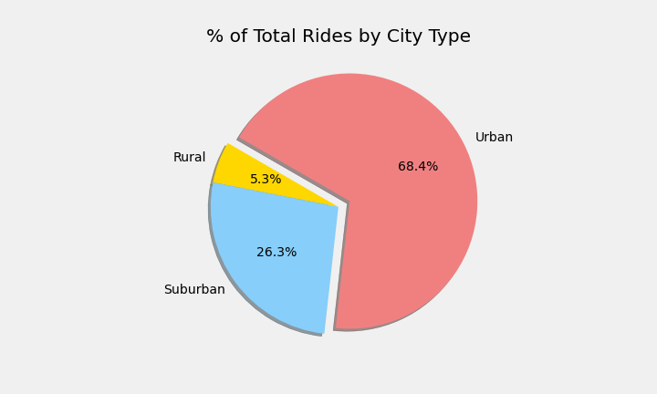
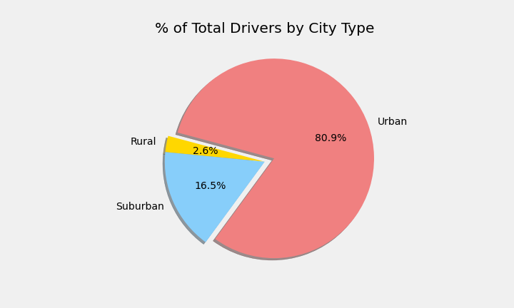

# **PyBer with Matplotlib**
	
## **Overview of Project** 
* As a Data Analyst at PyBer, a python based ride sharing app company, you will perform analysis on ride sharing data. By writing a python script using the pandas libraries, jupyter notebook and Matplotlib, we will create a variety of charts that showcase the relationship between the type of city and the number of drivers and riders as well as the percentages of total fares, riders and drivers by the type of city. The Analysis and visualization we create will help Pyber improve access to ride sharing services and determine affordability for underserved neighborhoods. 
 
### Purpose 
 
* Analyze and visualize ride sharing data to create a summary DataFrame (the total rides, total drivers, total fares, average fare per ride and driver) of the data by city type (Urban, Suburban and Rural). Then create a multiple-line graph that shows the total weekly fares for each city type. As well create a written report that summarizes how the data differs by city type and how those differences can be used by decision-makers at PyBer. 

 
### Pyber Summary DataFrame 

 

 
*  we can see from the image above; the total Rides are high in Urban cities 1625 followed by Suburban cities 625 rides and lowest in Rural cities 125 rides.

* we can see from the image above, the total Drivers are high in Urban cities with 2405 drivers, followed by Suburban cities with 490 drivers and lowest in Rural cities with 78 drivers.

 

 

* we can see from the pie charts (that are on the `Pyber_challenge` file at the end) the percentage of total rides in the Urban area is 68.4%, while (26.3% and 5.3%) in the Suburban and Rural cities. If we look at the second pie chart the percentages of total drivers by city type, for Urban is (80.9%) and (16.5% and 2.6%) for Suburban and Rural cities. This shows that there are more drivers (80.9%) in the Urban cities than the required riders or demand (68.4%). There are less drivers (16.5% and 2.6%) in the suburban and Rural cities than the required riders(demand) (26.3% and 5.3%). 

* we can see from the image above; the total Fares are high in Urban cities($39854.38) and for Suburban cities is $19356.33 and $4327.93 for Rural cities. Pyber makes most of their revenue in the Urban cities.

* The average fare per Ride is high in Rural cities around $ 34.62, followed by Suburban cities which is $30.97 and $ 24.53 in Urban cities. The Average fare is higher almost by $10 and $6 in Rural and Suburban cities than the Urban. 

* The average Fare per Driver is higher in Rural cities which $55.49 than Urban cities which is $16.57. The average fare per driver is $39.50 in Suburban Cities. This shows that drivers in Rural and Suburban cities make more than in Urban cities.

* when calculating the total drivers for each city type, we can not use the merged DataFrame `pyber_data_df` since the number of drivers are duplicated there. we have to use city dataframe.

### PyBer fare Summary

 

* The Muti line graph also supports the Summary data frame data for the total fares. we can see from the image above top yellow line represents weekly total fares for Urban cities between ($1600 - $2500) from 2019-01-01 to 2019-04-28. The weekly total Fare for Urban cities is highest from mid Feb to first week of march. The red line represents the weekly total fare for Suburban cities ($700 - $1400). The bottom blue line represents the weekly total fares for Rural cities ($50-$500). 

 
## **Summary** 

* Thee Business recommendations to the CEO for addressing any disparities among the city types

	* As mentioned above from the pie charts, the total number of drivers are more in Urban cities about `80%` than the total riders `68.4%`. There are more drivers in the Urban cities than needed. While in the suburban and Rural cities, the percentage of drivers `16.5% and 2.6%` are less than percentages of riders or demand `26.3% and 5.3%`. So, we recommend dispersing the extra 10% of drivers from Urban cities to support services in Suburban and Rural cities. 

	* The Average Fare per ride is higher in the Rural and Suburban cities (34.62, 30.97) respectively than Urban cities which is $24.53. It is approximately about ($10, $6) higher in the Suburban and Rural cities than the Urban. This difference may be related to extra miles travelled to get the riders to their destination. If this not due to distance, then we recommend to revisit pricing per mile cost for all cities. We also need to think about other variables that can cause the difference. 

	* Also, we need to address if there are other variables that can impact demand and supply of drivers in the Urban cities verses in the Suburban and Rural cities. For Example, do we have drivers in the Urban cities that are unable or unwilling to go to Rural and Suburban cities. 

	* The Average fare per driver is higher in Rural cities about $55 verses $16 in the Urban cities. In the Suburban cities is around $40. This could discourage some drivers from working with or joining PyBer in Urban cities due to lower average rate per driver.